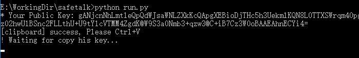
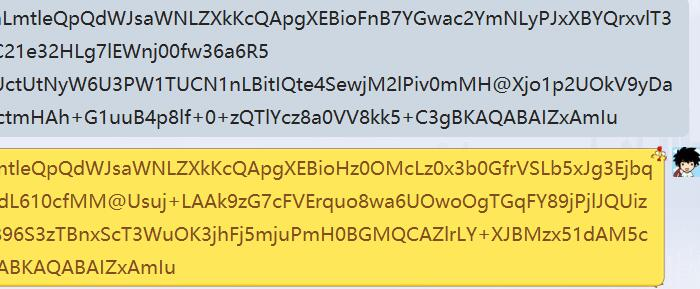
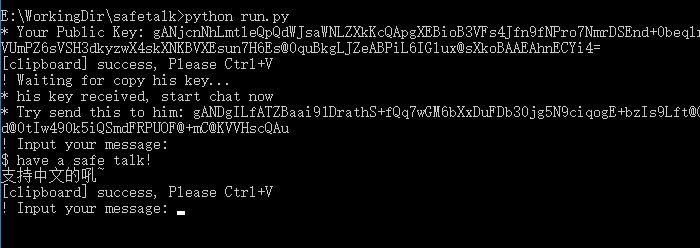
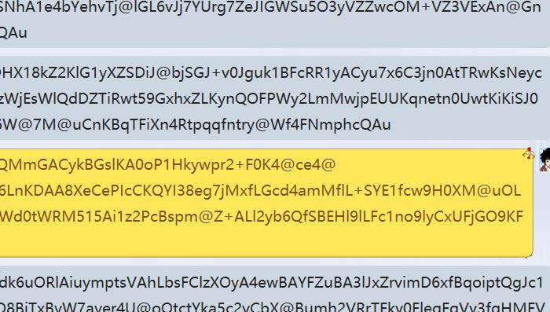

# safetalk

End to end talk encryption, defend against censorship

## Usage

1. python3 run.py

2. In chat window, press Ctrl+V to send your public key to him

3. He send to you his key, copy it, the program will automatically receive it

4. Write your message in the program, and then Ctrl+V to chat window

5. Copy his message, and decrypted message will be shown in the program

